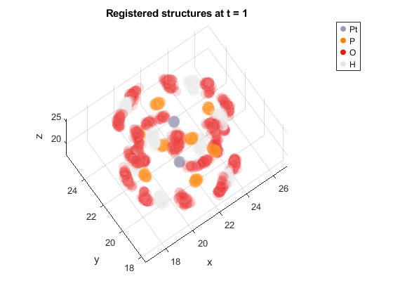

#     trajectory_registration

`AlignTraj.m` shows the wrokflow to align all trajectories to a common solute-based reference, and place everything into one consistent 3D frame.

The main point is simple: different trajectories can have arbitrary overall translation and rotation, which makes direct comparison and anisotropy `S2` simulations messy. This script removes that rigid-body motion so the remaining differences are the actual structural dynamics.

The test dataset (`test_traj_dataset.mat`) is composed of 50 trajectories of a solute (38 atoms) in solvent, overall 500 atoms, with the variables xyzt a [Natoms x 3 x Ntimes x Ntrajetroies] array, and AtomNames [Natomsx1] cell array. The original dataset had more atoms, but I trimmed it down to keep the example compact and GitHub-friendly.

We use the first time frame of the first trajectory as a reference, and align the solute part of every trajectory 1st time frame to that common structure with a mass-weighted rigid transform.
That gives each trajectory a rotation+translation, which are then applied to all time frames of that trajectory, and all atoms, so the internal motion is preserved.

After that, the script defines one final global frame from the aligned solute reference by centering it at its center of mass and orienting it along its principal axes. 
This just makes the final coordinates look nice around the origin and consistent, so all trajectories are centered and pointing the same way.

The registerd trajectories are in  `xyzt_final`, which has the same size as the input `xyzt` but now lives in one shared frame. 
If you comment out the `return` line near the end, the script also writes a small MP4 movie (`ensemble_movie.mp4`) showing how the aligned solute ensemble evolves in time.

The figure below shows the solute ensemble of 50 trajectories at the initial time point after registration to the common reference structure. This is a useful visual check that the trajectories were aligned properly before applying the final common orientation and before examining the later-time dynamics.

